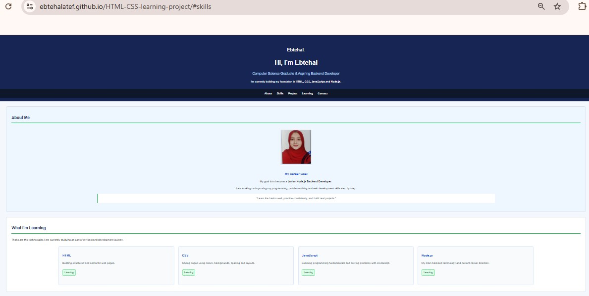

# HTML & CSS Learning Project

A simple personal project website built while learning HTML and CSS.

## About the Project

This project represents my current learning journey in web development.

I built the website from scratch to practice the HTML and CSS concepts I have learned.

## Technologies

- HTML5
- CSS3

## What I Practiced

- Semantic HTML
- Headings and paragraphs
- Links and images
- Lists
- Tables
- Forms and different input types
- Buttons
- Backgrounds
- Colors
- Margin and padding
- Borders
- Basic page layout
- Basic CSS styling

## Project Sections

The website includes:

- About Me
- Skills
- Current Project
- Learning Roadmap
- Code Example
- Resources
- Contact Form

## Live Demo

[View the website](https://ebtehalatef.github.io/HTML-CSS-learning-project/)

## Future Improvements

I plan to improve this project as I learn more about:

- JavaScript
- Responsive Design
- Advanced CSS
- Backend Development
- Node.js